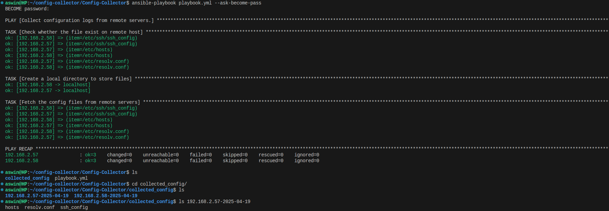

# Ansible Configuration File Fetcher

<div style="display: flex; align-items: center;">
    
    </div>
## Overview

This Ansible playbook is designed to fetch specific configuration files from remote Ubuntu servers and organize them into a directory structure locally, with the current date as part of the directory name. It is useful for system administrators who need to collect configuration files for auditing, backup, or analysis purposes.

## Features

Fetch configuration files from remote servers.

Create a local directory to store the fetched files with the date appended to the directory name.

Organize configuration files based on the host they were fetched from.

Ensure that all specified files exist on the remote host before fetching them.

## Requirements

- Ansible 2.x or higher

- SSH access to the remote servers

- Inventory file specifying the target servers under the servers group

## Supported Configuration Files

By default, this playbook fetches the following configuration files from each remote host:

/etc/ssh/ssh_config

/etc/hosts

/etc/resolv.conf

You can add or remove files from the files_to_copy list in the playbook as needed.

## Usage

### 1. Clone the Repository
Clone the repository to your local machine:

```bash
git clone https://github.com/aswinks123/Config-Collector
cd <Config-Collector>
``` 

### 2. Configure the Inventory
Create or modify the inventory file (e.g., hosts) to include your target servers. The servers group should contain all the hosts you wish to target.

Example hosts file:


[servers]
server1.example.com
server2.example.com
server3.example.com


### 3. Modify the Playbook (Optional)
In the playbook, you can modify the files_to_copy list to include or exclude any files as needed:


files_to_copy:
  - /etc/ssh/ssh_config
  - /etc/hosts
  - /etc/resolv.conf


### 4. Run the Playbook
Execute the playbook with the following command:

```bash
ansible-playbook playbook.yml --ask_become_pass 
```

### 5. Result
After the playbook completes, the configuration files will be fetched and stored locally in a directory structure like this:


collected_config/
  ├── server1.example.com-2025-04-19/
  │   ├── ssh_config
  │   ├── hosts
  │   └── resolv.conf
  ├── server2.example.com-2025-04-19/
  │   ├── ssh_config
  │   ├── hosts
  │   └── resolv.conf
  └── server3.example.com-2025-04-19/
      ├── ssh_config
      ├── hosts
      └── resolv.conf


Each server will have its configuration files stored in a separate folder, with the current date as the folder name.

### Sample Screenshot


